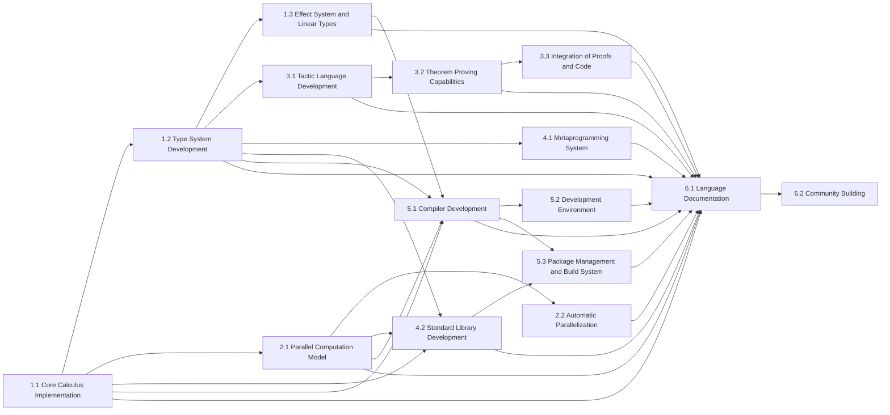

# Axiomadic (Ax)

<!--  -->

Axiomadic (Ax for short) is an ambitious project to create a revolutionary computational reasoning system that seamlessly integrates programming, proof assistance, and parallel computation.

```haskell
// Define a vector type
data Vec (A : Type) (n : Nat) : Type where
  Nil  : Vec A 0
  Cons : (x : A) -> (xs : Vec A n) -> Vec A (S n)

// Define a parallel map function
def pmap : (A B : Type) -> (n : Nat) -> (f : A -> B) -> Vec A n -> Vec B n
pmap A B Z f Nil = Nil
pmap A B (S n) f (Cons x xs) = 
  let x' = spawn (f x)
  let xs' = pmap A B n f xs
  Cons (sync x') xs'

// Define a doubling function
def double : Int -> Int
double x = x + x

// Theorem: pmap preserves length
theorem pmap_preserves_length : 
  (A B : Type) -> (n : Nat) -> (f : A -> B) -> (v : Vec A n) ->
  length (pmap A B n f v) = n
proof
  intros A B n f v
  induction n
    case Z  => reflexivity
    case S n' => 
      simpl
      rewrite <- IH
      reflexivity
qed

// Main function
def main : Vec Int 4
main = 
  let v = Cons 1 (Cons 2 (Cons 3 (Cons 4 Nil)))
  let result = pmap Int Int 4 double v
  assert (length result = 4)  // This should be automatically proved
  result

// Run main and print result
print (run main)
```

## Current Status: Early Development

Axiomadic is currently in the very early stages of development. We have a basic interpreter implemented in Rust, which serves as a proof of concept for some of our core ideas.

## Vision

Axiomadic aims to be more than just a programming language. Our goal is to create a comprehensive environment for developing, proving, and executing complex computational and mathematical ideas. 

- Dependent type system with Cubical Type Theory features
- Built-in parallel computation model (multi-core/CUDA/OpenCL)
- Integrated proof assistant with tactics
- Effect system and linear types
- Metaprogramming capabilities
- Automatic parallelization and proof-guided optimization

## Roadmap



Here's our high-level plan for developing Axiomadic:

- [x] Develop basic interpreter in Rust
- [ ] Implement core type system
  - [ ] Basic types (Int, Float, Bool, etc.)
  - [ ] Dependent types
  - [ ] Universe hierarchy
- [ ] Develop parallel computation model
- [ ] Implement proof assistant features
  - [ ] Basic tactics
  - [ ] Theorem proving capabilities
- [ ] Implement effect system and linear types
- [ ] Add metaprogramming capabilities
- [ ] Develop automatic parallelization and proof-guided optimization
- [ ] Create standard library
- [ ] Develop tooling (IDE support, debugger, etc.)
- [ ] Write comprehensive documentation
- [ ] Release alpha version

## Key Planned Features

1. **Dependent Type System**: Will support advanced type-level programming and verification.
2. **Built-in Parallel Computation**: Native support for parallel and concurrent programming.
3. **Integrated Proof Assistant**: Will allow for theorem proving and formal verification within the same environment.
4. **Effect System and Linear Types**: For precise control over side effects and resource usage.
5. **Metaprogramming Capabilities**: Will enable powerful code generation and transformation.
6. **Automatic Parallelization**: The compiler will automatically parallelize suitable computations.

## Getting Involved

While we're not yet at a stage where we can accept code contributions, we're very interested in feedback, ideas, and discussions about the theory and design of Axiomadic. 

If you're interested in following the development of Axiomadic or contributing ideas:

1. Star and watch this repository for updates.
2. Check out our [Discussions](https://github.com/yourusername/axiomadic/discussions) page to participate in design discussions.
3. If you find the concept exciting, spread the word! The more interest we generate, the more resources we can devote to making Axiomadic a reality.

## Current Example (Proof of Concept Interpreter)

Our current interpreter can handle basic arithmetic operations and function definitions. Here's a simple example:

```rust
let mut interpreter = Interpreter::new();

// Define a simple doubling function
let double_func = Expr::Lambda(
    vec!["x".to_string()],
    Box::new(Expr::Application(
        Box::new(Expr::Variable("+".to_string())),
        vec![Expr::Variable("x".to_string()), Expr::Variable("x".to_string())]
    ))
);
interpreter.env.insert("double".to_string(), interpreter.eval(&double_func).unwrap());

// Apply the function
let result = Expr::Application(
    Box::new(Expr::Variable("double".to_string())),
    vec![Expr::Literal(Value::Int(5))]
);

match interpreter.eval(&result) {
    Ok(value) => println!("Result: {}", value),
    Err(e) => println!("Error: {}", e),
}
```

This is just the beginning. Our goal is to evolve this into a full-fledged system supporting all the features described in our vision.

## License

Axiomadic is released under the [MIT License](LICENSE).

## Acknowledgements

Axiomadic is inspired by decades of research in programming languages, type theory, and formal verification. We're grateful to the entire PL community for laying the groundwork that makes this project possible.

---

We're at the start of an exciting journey to revolutionize computational reasoning. Stay tuned for updates!
```

This revised README reflects the early stage of the project, outlines the vision and roadmap, and provides a realistic picture of where the project currently stands. It also encourages community involvement in the form of discussions and idea-sharing, which is appropriate for this early stage of development.
